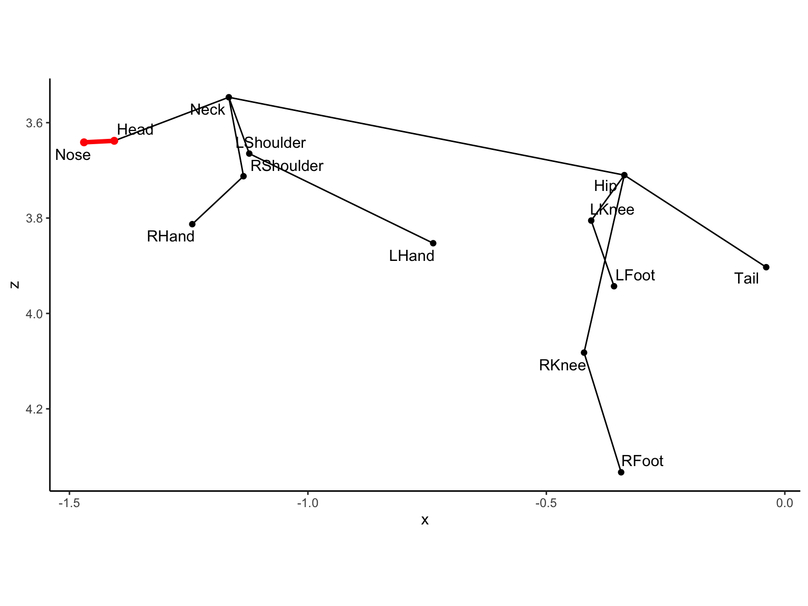
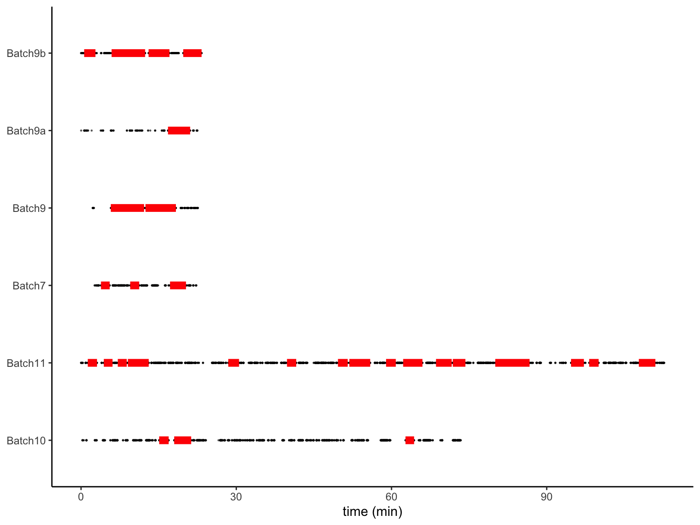

**Packages**

``` {.r .cell-code}
source("R/source.R")
source("R/f_OMS.R")
```

**path**

``` {.r .cell-code}
path_omp <- "data/rawdata_OMS"

path_mat <-
  path_omp %>% 
  list.files(pattern = "Batch", full.names = TRUE) %>% 
  map_chr(\(x){list.files(x, pattern = "coords_3D", full.names = TRUE)})

path_mat
```

```         
[1] "data/rawdata_OMS/Batch10/coords_3D.mat"
[2] "data/rawdata_OMS/Batch11/coords_3D.mat"
[3] "data/rawdata_OMS/Batch7/coords_3D.mat" 
[4] "data/rawdata_OMS/Batch9/coords_3D.mat" 
[5] "data/rawdata_OMS/Batch9a/coords_3D.mat"
[6] "data/rawdata_OMS/Batch9b/coords_3D.mat"
```


**import data**


``` {.r .cell-code}
dat_oms <-
  path_mat %>% 
  tibble(path = .) %>% 
  mutate(data = map(path, import_omp_data)) %>% 
  arrange_batch() %>% 
  unnest(data)
```


**visualization**


``` {.r .cell-code}
dat_f <-
  dat_oms%>% 
  filter(batch == "Batch10") %>% 
  filter(frame == 50780) 

gg_OMS_xz(dat_f) %>% 
  geom_ad_head(dat_f) +
  scale_y_reverse() +
  coord_fixed()
```


{width="768"}


**rotation**


``` {.r .cell-code}
dat_rot <-
  dat_oms %>% 
  group_nest(batch, frame) %>% 
  mutate(data = map(data, rot_HipNeck)) %>% 
  unnest(data)
```


**filter**


``` {.r .cell-code}
dat_rot_nest <-
  dat_rot %>% 
  wide_omp() %>% 
  arrange_fragment(.d = 200) %>%   # Different fragments for gaps of 200 frames or more
  group_nest(batch, fragment) %>% 
  mutate(l = map_dbl(data, nrow),
         start = map_dbl(data, ~ min(.$frame)),
         end = map_dbl(data, ~ max(.$frame)),
         d = (end - start) / 20) # fragment length (s)

dat_rot_nest_filter <-
  dat_rot_nest %>% 
  filter(d >= 100) 

# No. of fragments
dat_rot_nest_filter %>% nrow()
```


```         
[1] 29
```


``` {.r .cell-code}
# total duration (min)
dat_rot_nest_filter$d %>% sum() %>% {. / 60}
```


```         
[1] 90.38333
```


``` {.r .cell-code}
dat_g <-
  dat_rot %>% 
  filter(parts == "Head")

# All data points: black
# Available (continuous) data fragments: red
ggplot() +
  geom_point(data = dat_g, aes(frame, batch),
             size = 0.2, alpha = 0.5) +
  geom_segment(data = dat_rot_nest_filter,
               aes(x = start, xend = end, y = batch, yend = batch),
               color = "red", linewidth = 3) +
  scale_x_continuous(breaks = seq(0, 120 * 60 * 20, length = 5),
                     labels = seq(0, 120, length = 5)) +
  labs(x = "time (min)") +
  theme(axis.title.y = element_blank())
```


{width="768"}


**interpolation (with loess)**


``` {.r .cell-code}
dat_rot_loess <-
  dat_rot_nest_filter %>% 
  arrange_data_for_loess() %>% 
  mutate(loess = map2(
    data, l, \(x, y){loess(value ~ frame, data = x, span = 5/y)}
  ))

dat_rot_pred <-
  dat_rot_loess %>% 
  mutate(newx = map2(
    start, end, \(x, y){ seq(x, y, by = 20) })) %>%
  mutate(pred = map2(
    loess, newx, \(x, y){ predict(x, data.frame(frame = y)) })) %>% 
  select(batch, fragment, name, newx, pred) %>% 
  unnest(everything()) %>% 
  rename(frame = newx) %>% 
  pivot_wider(names_from = name,
              values_from = pred) %>% 
  group_by(batch, fragment) %>% 
  mutate(time = frame,
         time = time - min(time),
         time = time / 20) %>% 
  select(batch, fragment, frame, time, everything())
```


**save**

``` {.r .cell-code}
dat_rot_pred %>% 
  write_csv("data/dat_oms.csv")
```

