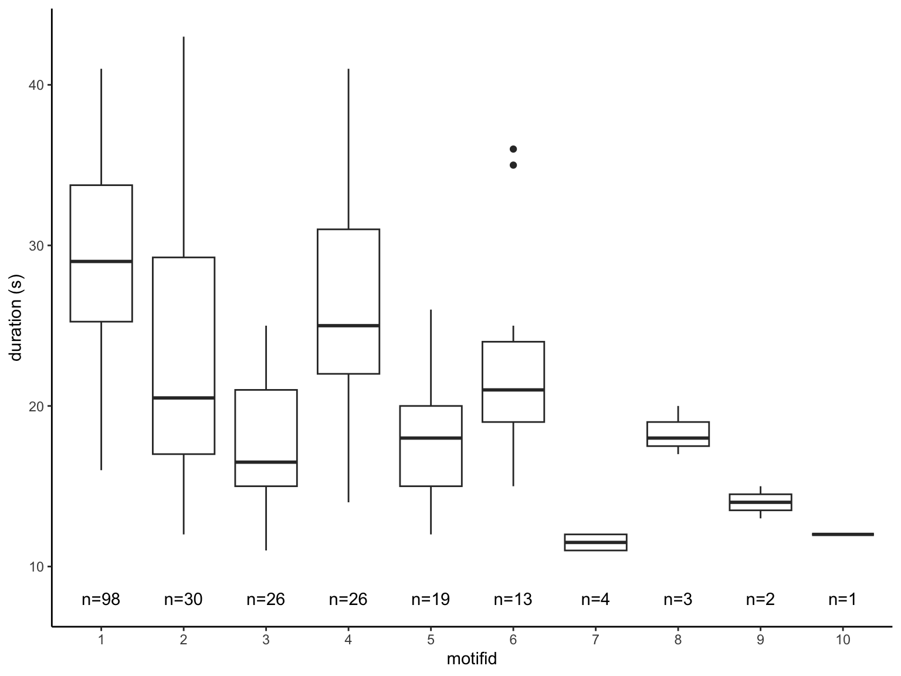
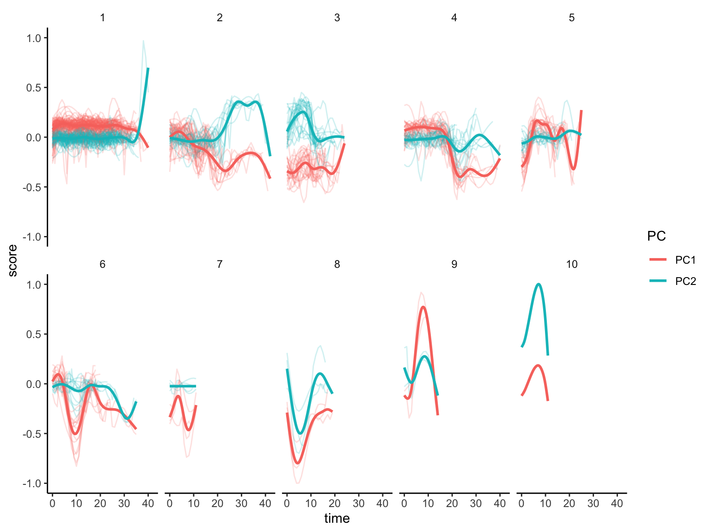
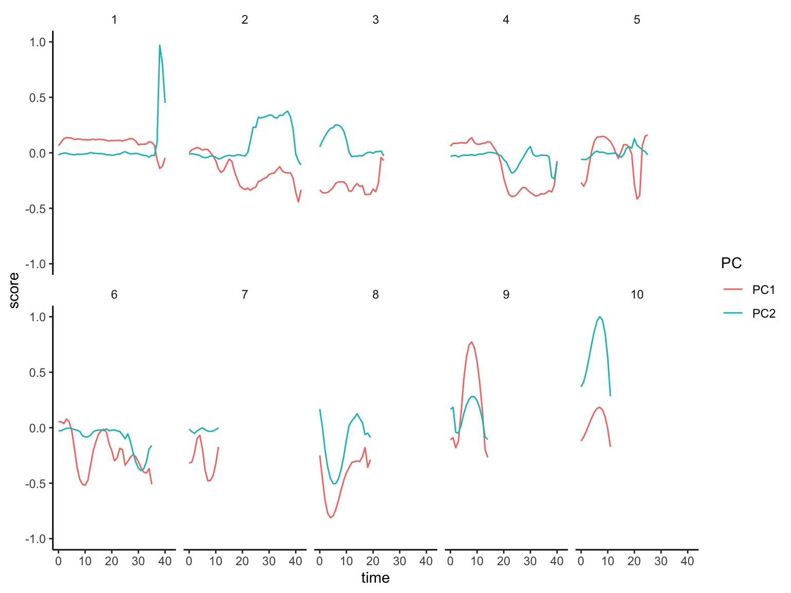
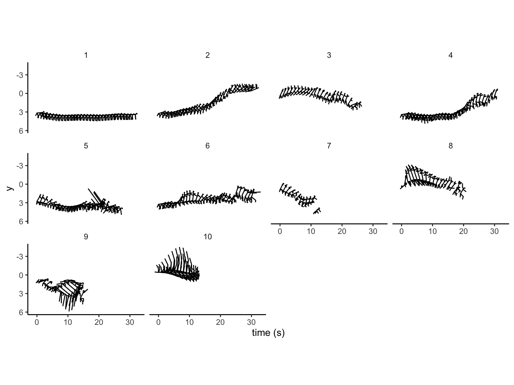

**Packages**

``` {.r .cell-code}
source("R/source.R")
source("R/f_OMS.R")
```

**Path**

``` {.r .cell-code}
path <- "data/dat_SMPresults_OMP.csv"
```

**import**

``` {.r .cell-code}
dat_raw <- 
  path %>% 
  fread() %>% 
  as_tibble()
```


**over view**

-   duration & n

``` {.r .cell-code}
dat_duration <-
  dat_raw %>% 
  group_nest(motiftag, motif) %>% 
  mutate(duration = map_dbl(data, nrow)) %>% 
  group_nest(motif) %>% 
  mutate(N = map_dbl(data, nrow)) %>% 
  arrange(desc(N)) %>% 
  rowid_to_column("lank") %>% 
  unnest(data) %>% 
  mutate(lank = factor(lank))

dat_lank <-
  dat_duration %>% 
  select(lank, motif, N) %>% 
  distinct()
```

``` {.r .cell-code}
ggplot(data = dat_duration) +
  aes(lank, duration) +
  geom_boxplot() +
  geom_text(data = dat_lank,
            aes(y = 8, label = str_c("n=", N))) +
  labs(y = "duration (s)", x = "motifid")
```

{width="768"}

-   PCs

``` {.r .cell-code}
dat_pca <-
  dat_raw %>% 
  left_join(dat_lank %>% select(!N), by = "motif") %>% 
  group_by(motiftag) %>% 
  mutate(time = time - min(time)) %>% 
  ungroup()

dat_pca_long <-
  dat_pca %>% 
  select(motiftag, motif, lank, time, PC1, PC2) %>% 
  pivot_longer(
    cols = contains("PC"),
    names_to = "PC",
    values_to = "score"
  ) %>% 
  arrange(motiftag, motif, lank, PC, time) %>% 
  mutate(grp = str_c(motiftag, PC))
```

``` {.r .cell-code}
ggplot(dat_pca_long) +
  aes(time, score, color = PC) +
  geom_path(aes(group = grp), alpha = 0.2) +
  geom_smooth(se = FALSE) +
  facet_wrap(~lank, nrow = 2)
```

{width="768"}

**inverse PCA**

-   pca

``` {.r .cell-code}
list_params <-
  dat_raw %>% 
  select(starts_with("x_"),
         starts_with("y_"),
         starts_with("z_")) %>% 
  names()

pca <-
  dat_raw %>% 
  select(all_of(list_params)) %>% 
  prcomp(scale = TRUE)
```

-   mean of PCs

``` {.r .cell-code}
dat_pcs_mean <-
  dat_pca %>% 
  select(motiftag, motif, lank, time, starts_with("PC")) %>% 
  group_by(motif, lank, time) %>% 
  summarise(across(starts_with("PC"), mean)) %>% 
  ungroup()
```

``` {.r .cell-code}
dat_pcs_mean %>% 
  select(motif, lank, time, PC1, PC2) %>% 
  pivot_longer(
    cols = contains("PC"),
    names_to = "PC",
    values_to = "score"
  ) %>% 
  arrange(motif, lank, PC, time) %>% 
  ggplot() +
  aes(time, score, color = PC) +
  geom_path() +
  scale_y_continuous(limits = c(-1, 1)) +
  facet_wrap(~lank, nrow = 2)
```



-   inv PCA

``` {.r .cell-code}
dat_params_raw <-
  dat_pcs_mean %>% 
  select(starts_with("PC")) %>% 
  inv_pcsscale(pca) %>% 
  inv_pca(pca) %>% 
  bind_cols(dat_pcs_mean, .)

write_csv(dat_params_raw,
          "data/dat_OMS_invPCA.csv")
```

-   visualization

``` {.r .cell-code}
dat_params_xyz <-
  dat_params_raw %>% 
  arrange_xyz() %>% 
  filter(time <= 30) %>% 
  rename(sec = time)
```

``` {.r .cell-code}
dat_params_xyz %>% 
  mutate(x = x + sec * 0.5) %>% 
  gg_OMS_xy2() +
  scale_y_reverse() +
  coord_fixed() +
  facet_wrap(~lank, nrow = 3) +
  scale_x_continuous(breaks = seq(0, 15, by = 5),
                     labels = seq(0, 15, by = 5) * 2) +
  labs(x = "time (s)")
```


